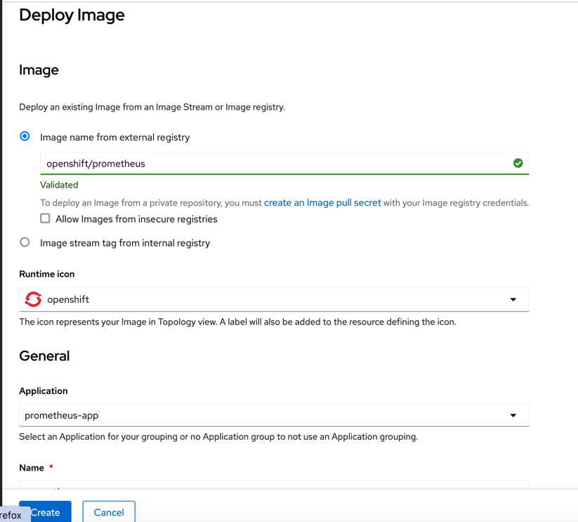
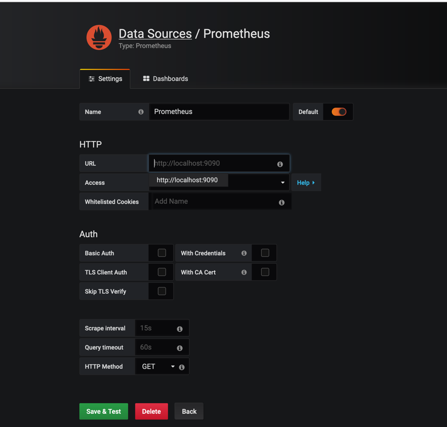
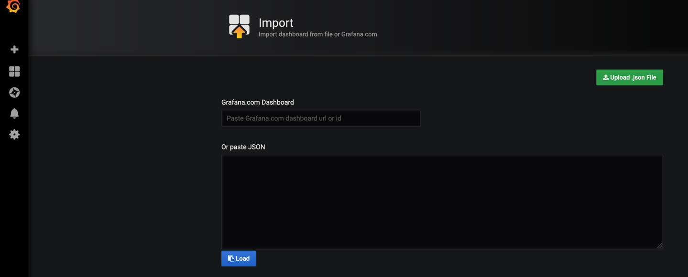

# micrometering-with-quarkus project

Full details about this project can be found here: https://dzone.com/articles/extra-micrometer-practices-with-quarkus

This project uses Quarkus, the Supersonic Subatomic Java Framework.

If you want to learn more about Quarkus, please visit its website: https://quarkus.io/ .

## Running the application in dev mode

You can run your application in dev mode that enables live coding using:
```shell script
./mvnw compile quarkus:dev
```

## Packaging and running the application

The application can be packaged using:
```shell script
./mvnw package
```
It produces the `micrometering-with-quarkus-1.0.0-SNAPSHOT-runner.jar` file in the `/target` directory.
Be aware that it’s not an _über-jar_ as the dependencies are copied into the `target/lib` directory.

If you want to build an _über-jar_, execute the following command:
```shell script
./mvnw package -Dquarkus.package.type=uber-jar
```

The application is now runnable using `java -jar target/micrometering-with-quarkus-1.0.0-SNAPSHOT-runner.jar`.

## Setup Prometheus on Red Hat OpenShift Developer Sandbox 

Once you have your Red Hat account, you can obtain free of charge a Sandbox by going to: https://developers.redhat.com/developer-sandbox/get-started.
For **development** purposes only, you can setup Prometheus by following the steps below:

* Make sure you are in *Developer* view.
* Click on **+Add** and select the **Container Images** card.
* Fill in the image name with **openshift/prometheus** and leave the other default values.

* Click on **Create** button.
* Next, open the web terminal by pressing the icon **>_** located in the upper right corner.
* Type the following commands there:

```shell script
curl https://raw.githubusercontent.com/ammbra/micrometering-with-quarkus/feature/techflow-code/kubefiles/prometheus.yaml -o prometheus.yaml

oc create cm prometheus-config --from-file=prometheus.yaml

oc set volume deployment/prometheus --add --name=prometheus-config --type=configmap --configmap-name=prometheus-config --mount-path=/etc/prometheus/

kubectl patch deployment prometheus \
--type=json \
-p='[{"op": "add", "path": "/spec/template/spec/containers/0/args/-", "value": "--config.file=/etc/prometheus/prometheus.yaml"}]'

oc expose svc prometheus
```

## Setup Grafana on Red Hat OpenShift Developer Sandbox 

For **development** purposes only, you can setup Grafana by following the steps below:

* Make sure you are in *Developer* view.
* Click on **+Add** and select the **Container Images** card.
* Fill in the image name with **grafana/grafana:6.0.1** and leave the other default values.
* Click on **Create** button.
* Next, open the web terminal by pressing the icon **>_** located in the upper right corner.
* Type the following commands in the web terminal to get an external url where you can access Grafana:

```shell script
oc expose svc grafana
```
* Once you have the external URL to Grafana, open it in a browser tab and use the admin/admin default Grafana credentials.
* You can change the password used by admin after your first login.
* Next, add Prometheus as datasource in your Grafana by following the UI steps.
You can use the URL of the route to Prometheus for an easier connection.


* Next, you can import the **experimental** dashboard used in the demos by loading [Micrometer Sample.json](Micrometer Sample.json) via Upload .json file.


